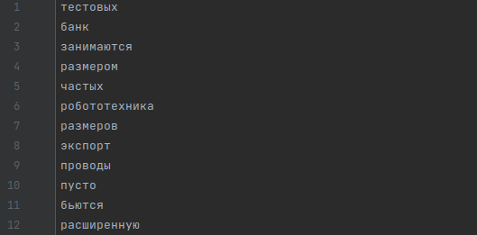
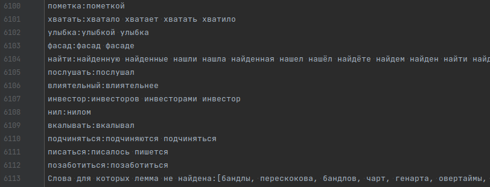

# Домашняя работа #2

### Input:

HTML страницы из папки hw_2/in (Названия: 0, 1, 2, 3...)

### Processing:

Парсит страницы из папки in, токенизирует текст и лемматизирует, разбивая не группы.
Необходимо предварительно положить в папку in страницы и прописать путь к директории hw_2
в коде программы (Если меняются пути)

### Output

- tokens.txt - список токенов

- lemmas.txt - разбитые на леммы токены

